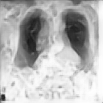

# Image Denoising using Convolutional Autoencoders

## Overview
This project implements an image denoising system using Convolutional Autoencoders (CAE). The model is trained on noisy grayscale X-ray images and aims to reconstruct high-quality denoised images. The solution is deployed using **Streamlit**, allowing users to upload noisy X-ray images and download the cleaned version.

## Features
- **Convolutional Autoencoder Architecture** for image denoising.
- **Trained on the MURA Dataset**, which contains musculoskeletal radiographs.
- **Uses Multi-Layer Perceptual Loss with VGG19** for high-quality image reconstruction.
- **Streamlit-based UI** for uploading, processing, and downloading images.
- **Sharpening Filter** applied post-denoising for enhanced image quality.
- **Download Option** for retrieving denoised images.

## Dataset
We use the **MURA (Musculoskeletal Radiographs) dataset** from Stanford ML Group. It contains X-ray images for different body parts. The dataset is automatically downloaded and extracted.

## Model Architecture
- **Encoder:**
  - Convolutional layers with ReLU activation
  - Batch Normalization
  - Max Pooling layers for dimensionality reduction
  - Dropout for regularization
- **Bottleneck:**
  - Deep feature extraction using a 256-filter convolutional layer
- **Decoder:**
  - UpSampling layers to restore image dimensions
  - Final convolutional layer with sigmoid activation for reconstruction
- **Loss Function:**
  - **Multi-layer Perceptual Loss** (using VGG19 features) + **Pixel-wise MSE Loss**

## Installation
Clone the repository and install the dependencies:

```bash
git clone https://github.com/alchemyofinsights/Image-Denoising-using-Convolutional-Autoencoders.git
cd Image-Denoising-using-Convolutional-Autoencoders
pip install -r requirements.txt
```

## Training the Model
The model is provided as a Jupyter Notebook (`Image_denoising.ipynb`). To train it, open the notebook and run all cells.

Alternatively, run the following command in Jupyter Notebook:

```bash
jupyter notebook Image_denoising.ipynb
```

## Running the Streamlit App
The Streamlit app is provided as `modelview.py`. To launch the web interface, use:

```bash
streamlit run modelview.py
```

## Usage
1. Upload a noisy grayscale X-ray image (JPG, PNG, or JPEG format).
2. The model will process the image and display the denoised result.
3. Download the denoised image using the **Download** button.

## Example Results
| Original | Noisy | Denoised |
|----------|-------|----------|
|  |  |  |

## Future Improvements
- Experimenting with **U-Net** architecture for better performance.
- Adding **GAN-based denoising** for higher-quality reconstructions.
- Deploying as a **web service (FastAPI/Flask)** for wider accessibility.

## License
This project is licensed under the MIT License.

## Contributors
- **AlchemyOfInsights** - [GitHub]([https://github.com/alchemyofinsights])

